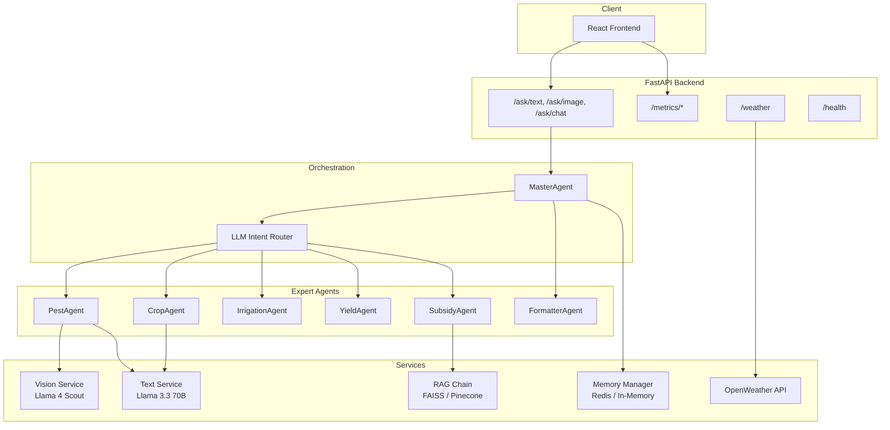
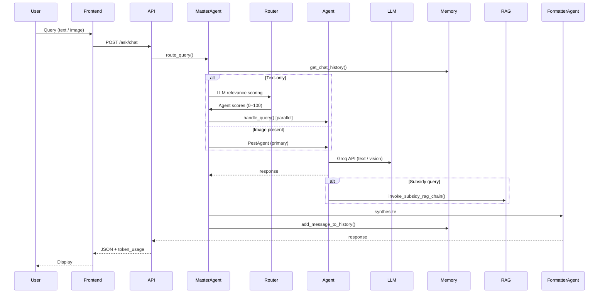

# 🌾 AgriGPT – Multimodal AI Farming Assistant

[](https://github.com/isakshay007/AgriGPT/actions/workflows/ci.yml)

**AgriGPT** is an end-to-end **multimodal, multi-agent agricultural advisory system** that delivers reliable, domain-specific, and safety-aware guidance to farmers. It supports **text queries, image-based crop diagnosis, and multi-turn conversations**, intelligently routing requests to specialized expert agents for crop management, pest diagnostics, irrigation, yield analysis, and government subsidies.

Unlike generic chatbots, AgriGPT decomposes user intent and orchestrates multiple constrained expert agents—**reducing hallucinations** and enabling **explainable, grounded responses**.

---

## Table of Contents

- [Architecture](#-architecture)
- [Key Features](#-key-features)
- [Project Structure](#-project-structure)
- [Agents](#-agent-based-design)
- [API & Metrics](#-api--metrics)
- [Technology Stack](#-technology-stack)
- [Getting Started](#-getting-started)
- [Authors](#-authors)

---

## Architecture

### System Overview



### Request Flow



---

##  Key Features

| Feature | Description |
|---------|-------------|
| **Multi-Agent** | 7 specialized agents with strict role boundaries; max 3 agents per query |
| **Multimodal** | Text-only, image-only, or text + image in a single flow |
| **Vision AI** | Crop pest & disease diagnosis via Groq Llama 4 Scout |
| **RAG** | SubsidyAgent uses FAISS/Pinecone; no hallucinated schemes |
| **Memory** | Redis-backed or in-memory; last 10 messages per session |
| **Metrics** | Usage (by agent, type, day) + quality (satisfaction rate) |
| **CI/CD** | GitHub Actions: tests, lint, Docker build |
| **Token Tracking** | Per-request and per-session cost estimation |

---

##  Project Structure

```
AgriGPT/
├── backend/
│   ├── agents/           # Multi-agent system
│   │   ├── master_agent.py      # Orchestrator, LLM router
│   │   ├── crop_agent.py
│   │   ├── pest_agent.py
│   │   ├── irrigation_agent.py
│   │   ├── yield_agent.py
│   │   ├── subsidy_agent.py     # RAG + guardrails
│   │   └── formatter_agent.py
│   ├── core/
│   │   ├── config.py
│   │   ├── llm_client.py
│   │   ├── memory_manager.py    # Redis / in-memory
│   │   ├── router_schema.py     # Pydantic router output
│   │   ├── token_tracker.py
│   │   └── guardrails.py
│   ├── routes/
│   │   ├── ask_router.py
│   │   ├── metrics_router.py
│   │   ├── health_router.py
│   │   └── weather_router.py
│   ├── services/
│   │   ├── vision_service.py
│   │   ├── text_service.py
│   │   ├── rag_chain.py         # LCEL RAG pipeline
│   │   ├── feedback_service.py
│   │   └── history_service.py
│   ├── prompts/
│   │   └── prompts.yaml
│   ├── data/
│   │   ├── subsidies.json
│   │   ├── query_log.json
│   │   └── feedback_log.json
│   └── tests/
├── frontend-main/
│   ├── src/
│   │   ├── pages/        # Chat, ImageDiagnosis, History
│   │   ├── components/
│   │   ├── api/
│   │   └── store/
│   └── ...
├── .github/workflows/ci.yml
└── docker-compose.yml
```

---

## 🤖 Agent-Based Design

| Agent | Responsibility |
|-------|-----------------|
| **MasterAgent** | Interprets intent, routes queries, coordinates execution |
| **ClarificationAgent** | Handles vague queries with targeted follow-ups |
| **CropAgent** | Cultivation, fertilizer, soil preparation |
| **PestAgent** | Pest & disease diagnosis (image-first, vision model) |
| **IrrigationAgent** | Water management, scheduling |
| **YieldAgent** | Yield analysis, limiting factors |
| **SubsidyAgent** | Government schemes via RAG (FAISS/Pinecone) |
| **FormatterAgent** | Final synthesis (no new reasoning) |

**Routing rules:** Primary agent ≥75 score; supporting agents ≥50; max 3 agents; PestAgent auto-included when image present.

---

##  API 

### Endpoints

| Endpoint | Method | Description |
|----------|--------|-------------|
| `/ask/text` | POST | Text-only farming queries |
| `/ask/image` | POST | Image-only crop diagnosis |
| `/ask/chat` | POST | Multimodal (text + optional image) |
| `/weather/current` | GET | Location-based weather |
| `/health` | GET | Service health, models, dependencies |
| `/metrics/usage` | GET | Usage metrics (agents, types, daily counts) |
| `/metrics/quality` | GET | Quality metrics (feedback, satisfaction rate) |
| `/metrics/feedback` | POST | Submit positive/negative feedback |
| `/docs` | GET | OpenAPI Swagger UI |


---

## Technology Stack

### Backend
- **Python 3.11/3.12** · **FastAPI** · **Pydantic**
- **Groq** – Llama 3.3 70B (text), Llama 4 Scout (vision)
- **LangChain** · **LangSmith** (tracing)
- **FAISS** / **Pinecone** (RAG vector store)
- **Redis** (chat memory) or in-memory fallback
- **Sentence-transformers** (embeddings)
- **OpenWeather API**
- **Ruff** (linting) · **pytest** (tests)

### Frontend
- **React 18** · **TypeScript** · **Vite**
- **Tailwind CSS** · **Framer Motion**
- **Zustand** (state) · **Axios** · **React Query**
- **Radix UI** · **shadcn/ui**

### DevOps
- **Docker** · **docker-compose**
- **GitHub Actions** (CI: tests, lint, Docker build)
- **Nginx** (frontend reverse proxy)

---

## Getting Started

### Prerequisites
- Python 3.11 or 3.12
- Node.js 20+
- [Groq API key](https://console.groq.com)

### Backend

```bash
cp backend/env.example backend/.env
# Edit backend/.env: set GROQ_API_KEY

pip install -r backend/requirements.txt
uvicorn backend.main:app --reload
```

→ Backend: http://localhost:8000 | API docs: http://localhost:8000/docs

### Frontend

```bash
cd frontend-main
npm install
npm run dev
```

→ Frontend: http://localhost:3000

### Docker

```bash
# Set GROQ_API_KEY in .env, then:
docker-compose up --build
```

- Backend: http://localhost:8000  
- Frontend: http://localhost:3000  
- Redis: persistent chat memory  

### Environment (.env)

| Variable | Required | Description |
|----------|----------|-------------|
| `GROQ_API_KEY` | Yes | Groq API key |
| `OPENWEATHER_API_KEY` | No | Weather in header |
| `REDIS_URL` | No | `redis://localhost:6379/0` for persistent memory |
| `PINECONE_API_KEY` | No | RAG; falls back to FAISS if unset |
| `LANGSMITH_API_KEY` | No | LLM tracing |

### Tests

```bash
pytest backend/tests/ -v
```

---

## License

This project is intended for academic purposes only.

---

## Authors

**Akshay Keerthi Adhikasavan Suresh** 

---
